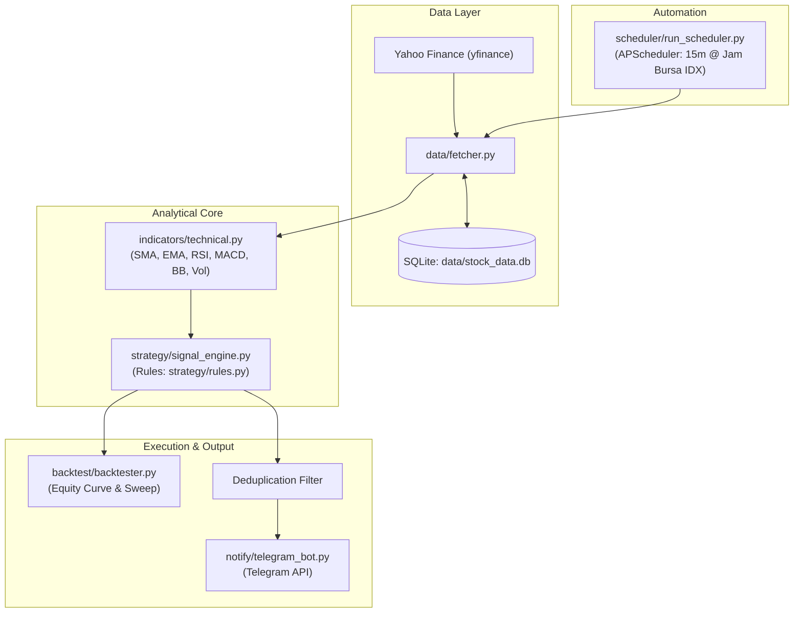

# 📈 Bot Analisis & Sinyal Trading Saham (Indonesia / IDX)

Sistem bot Python modular untuk analisis teknikal pasar saham Bursa Efek Indonesia (IDX / BEI), penghasil sinyal trading otomatis (**BUY / SELL / HOLD**) berbasis aturan deklaratif, pengujian historis (*backtesting* realistis dengan *zero lookahead bias*), dan pengiriman notifikasi kartu sinyal ke Telegram secara berkala selama jam bursa berlangsung.

> [!IMPORTANT]
> **Sistem Rekomendasi Murni (Advisory):** Sistem ini **TIDAK** melakukan eksekusi order otomatis ke broker sekuritas. Bot murni bertindak sebagai asisten analisis dan rekomendasi sinyal; eksekusi transaksi tetap dilakukan secara manual oleh pengguna.

---

## 📑 Daftar Isi
1. [Fitur Utama](#-fitur-utama)
2. [Tech Stack & Arsitektur](#-tech-stack--arsitektur)
3. [Panduan Instalasi & Setup](#-panduan-instalasi--setup)
4. [Panduan Konfigurasi (`config.yaml`)](#-panduan-konfigurasi-configyaml)
5. [Cara Menjalankan Bot (CLI Guide)](#-cara-menjalankan-bot-cli-guide)
6. [Trading Harian (Day Trading & Swing)](#-trading-harian-day-trading--swing)
7. [Panduan Deploy ke Cloud Railway (24/7)](#-panduan-deploy-ke-cloud-railway-247)
8. [Cara Menambahkan Strategi dari Buku/PDF Teknikal](#-cara-menambahkan-strategi-dari-bukupdf-teknikal)
9. [Pembahasan Risiko Overfitting](#-pembahasan-risiko-overfitting-dalam-trading-algoritmik)
10. [Disclaimer Finansial](#-disclaimer-finansial)

---

## 🚀 Fitur Utama

- **Data Fetcher Otomatis:** Mengambil data OHLCV harian (`1d`) dan intraday (`15m`, `30m`) dari Yahoo Finance dengan auto-normalisasi kode BEI (misal `BBCA` $\to$ `BBCA.JK`), dilengkapi mekanisme *exponential retry backoff*.
- **Database Lokal SQLite:** Caching data candle OHLCV, riwayat sinyal, dan log hasil backtest (tanpa perlu server database terpisah).
- **Indikator Teknikal Lengkap:**
  - Simple Moving Average (SMA) & Exponential Moving Average (EMA) multi-periode (20, 50, 200).
  - Relative Strength Index (RSI 14) dengan *Wilder's Smoothing*.
  - Moving Average Convergence Divergence (MACD 12, 26, 9) + Histogram.
  - Bollinger Bands (20, 2.0 std dev: Upper, Middle, Lower, Bandwidth).
  - Volume Analysis (Rata-rata 20 periode & Rasio Volume terkini).
- **Rule Engine Deklaratif & Fleksibel:** Aturan sinyal ditulis secara deklaratif (`RuleCondition`), mendukung operator logika (`<`, `<=`, `>`, `>=`, `cross_above`, `cross_under`), multi-rule `AND`/`OR`, serta multi-strategi simultan dengan *audit trail* alasan pemicu sinyal.
- **Rencana Trading Harian (Trading Plan):** Otomatis menghitung level harga *Entry*, *Target Profit (TP)*, *Stop Loss (SL)*, dan *Risk/Reward Ratio (RRR)* untuk setiap sinyal beli.
- **Modul Backtesting Realistis:**
  - Menghitung *Win Rate*, *Total Trades*, *Profit Factor*, *Maximum Drawdown*, *Total Return vs Buy & Hold*.
  - Menghasilkan visualisasi grafik *Equity Curve* resolusi tinggi ke folder `reports/`.
  - Simulasi biaya komisi broker (0.15% beli, 0.25% jual) dan slippage pasar (0.1%).
  - *Parameter Sweep* otomatis untuk optimasi kombinasi threshold.
- **Notifikasi Telegram & Bot Interaktif:**
  - Kartu notifikasi rapi berformat HTML lengkap dengan ringkasan indikator dan level TP/SL.
  - Perintah interaktif: `/status`, `/watchlist`, `/lasthistory`.
  - Mendukung mode simulasi jika token bot belum diisi (tidak membuat bot crash).
- **Scheduler Jam Bursa IDX (WIB):**
  - Menggunakan `APScheduler` dengan interval 15 menit.
  - Menyesuaikan sesi perdagangan BEI: Sesi 1 (09:00–11:30 WIB) & Sesi 2 (13:30–15:50 WIB / 14:00–15:50 WIB hari Jumat).
  - Otomatis jeda saat istirahat siang, salat Jumat, dan akhir pekan.
  - **Deduplikasi Sinyal:** Mencegah spam notifikasi berulang untuk kondisi sinyal yang sama.

---

## 🏗 Tech Stack & Arsitektur



### Struktur Folder
```
stock-signal-bot/
├── config/
│   ├── config.yaml          # Parameter watchlist, indikator, strategi, jadwal
│   ├── .env.example         # Template token Telegram
│   └── settings.py          # Loader konfigurasi & rotating file logger
├── data/
│   ├── fetcher.py           # yfinance wrapper dengan retry backoff
│   └── storage.py           # Manajer SQLite (OHLCV, sinyal, backtest)
├── indicators/
│   └── technical.py         # Kalkulasi SMA, EMA, RSI, MACD, BB, Volume
├── strategy/
│   ├── rules.py             # Definisi RuleCondition & Strategy deklaratif
│   └── signal_engine.py     # Evaluasi sinyal live & historis + TP/SL level
├── backtest/
│   └── backtester.py        # Simulasi trade, metrik win rate, equity curve
├── notify/
│   └── telegram_bot.py      # Notifier sinyal kartu & command bot Telegram
├── scheduler/
│   └── run_scheduler.py     # APScheduler otomatis saat jam bursa IDX
├── reports/                 # Output grafik equity curve (.png)
├── logs/                    # Log harian bot (stock_bot.log)
├── tests/                   # Unit test pytest & uji verifikasi bertahap
├── main.py                  # CLI entry point
├── requirements.txt
└── README.md
```

---

## 🛠 Panduan Instalasi & Setup

### 1. Prasyarat Sistem
- Python 3.11+ atau Python 3.12 (Sangat disarankan menggunakan `uv` yang terbukti kompatibel dengan pustaka kuantitatif).

### 2. Setup Virtual Environment
Buka terminal / PowerShell di root folder proyek:

```bash
# Menggunakan uv (direkomendasikan):
uv venv .venv --python 3.12
.venv\Scripts\activate

# Instal seluruh dependensi:
uv pip install -r requirements.txt --python .venv\Scripts\python.exe
```

*Atau menggunakan Python standar:*
```bash
python -m venv .venv
.venv\Scripts\activate
pip install -r requirements.txt
```

### 3. Konfigurasi Token Telegram (`.env`)
Salin file template `.env.example` menjadi `.env`:
```bash
cp config/.env.example .env
```
Buka file `.env` dan masukkan kredensial bot Telegram Anda:
```ini
TELEGRAM_BOT_TOKEN=123456789:ABCdefGhIJKlmNoPQRsTUVwxyZ
TELEGRAM_CHAT_ID=123456789
APP_ENV=production
```
> [!TIP]
> - Dapatkan **Bot Token** dari [@BotFather](https://t.me/BotFather) di Telegram via perintah `/newbot`.
> - Dapatkan **Chat ID** Anda dari [@userinfobot](https://t.me/userinfobot) di Telegram.
> - *Jika token belum diisi, bot akan berjalan dalam mode simulasi aman tanpa crash.*

---

## ⚙️ Panduan Konfigurasi (`config.yaml`)

File [`config/config.yaml`](file:///d:/bot%20saham/config/config.yaml) adalah pusat kontrol seluruh sistem:

```yaml
# Daftar saham yang dipantau (Gunakan suffix .JK)
watchlist:
  - BBCA.JK
  - BBRI.JK
  - BMRI.JK
  - TLKM.JK
  - ASII.JK

# Mode Trading: 'intraday' (15m) atau 'daily' (1d)
trading:
  mode: "intraday"
  intraday:
    interval: "15m"
    take_profit_pct: 2.5    # Target Profit 2.5%
    stop_loss_pct: 1.5      # Stop Loss 1.5%
  daily:
    interval: "1d"
    take_profit_pct: 5.0    # Target Profit 5.0%
    stop_loss_pct: 3.0      # Stop Loss 3.0%

# Strategi Aktif yang Dipakai Live
strategies:
  active: "DayTrading_Intraday_Momentum"
```

---

## 💻 Cara Menjalankan Bot (CLI Guide)

Sistem menyediakan antarmuka CLI yang mudah digunakan melalui file [`main.py`](file:///d:/bot%20saham/main.py):

### 1. Pindai Saham Terkini (One-Time Scan)
Memindai seluruh saham di watchlist secara instan dan mencetak tabel status sinyal:
```bash
python main.py scan
```

### 2. Perbarui Data Historis Saham (Fetch)
Mengunduh data candle terbaru dari Yahoo Finance dan menyimpannya ke database lokal:
```bash
# Unduh seluruh watchlist:
python main.py fetch

# Unduh 1 saham tertentu (misal BBCA interval 15m untuk 60 hari):
python main.py fetch --ticker BBCA.JK --interval 15m --period 60d
```

### 3. Menjalankan Backtest Strategi
Menguji kinerja strategi ke data historis dan menghasilkan grafik *Equity Curve*:
```bash
# Backtest harian:
python main.py backtest --ticker BBCA.JK --interval 1d --period 2y

# Backtest day trading intraday 15-menit:
python main.py backtest --ticker BBCA.JK --interval 15m --period 60d --tp 2.5 --sl 1.5
```
Grafik hasil backtest otomatis tersimpan di folder `reports/backtest_<ticker>_<strategy>.png`.

### 4. Menjalankan Parameter Sweep
Mencari kombinasi parameter terbaik (threshold RSI & pengali Volume):
```bash
python main.py sweep --ticker BBCA.JK --interval 1d
```

### 5. Menjalankan Bot Pemantauan Otomatis (Live Scheduler)
Menjalankan bot scheduler otomatis tiap 15 menit saat jam bursa BEI berlangsung:
```bash
python main.py live
```

### 6. Menjalankan Bot Telegram Interaktif
Menjalankan listener perintah bot Telegram (`/status`, `/watchlist`, `/lasthistory`):
```bash
python main.py telegram
```

### 7. Menjalankan Keduanya Bersamaan (Scheduler + Telegram Bot)
```bash
python main.py run-all
```

---

## ⚡ Trading Harian (Day Trading & Swing)

Sistem telah dilengkapi konfigurasi khusus trading harian:
1. **Intraday Day Trading (15m):**
   - Menggunakan candle interval 15-menit.
   - Evaluasi cepat momentum intraday ($Close > EMA_{20}$, $RSI > 50$, konfirmasi lonjakan volume).
   - Dilengkapi proteksi *Stop Loss* ketat (default $1.5\%$) dan *Target Profit* realistis (default $2.5\%$).
2. **Daily Swing Trading (1D):**
   - Menggunakan candle harian.
   - Mencari titik pantulan (*pullback*) di atas tren $EMA_{50}$ dengan batas TP $5.0\%$ dan SL $3.0\%$.

---

## 🚂 Panduan Deploy ke Cloud Railway (24/7)

Bot ini sudah 100% siap di-deploy ke **Railway** untuk berjalan 24 jam nonstop:
- File konfigurasi Railway sudah tersedia: [`Dockerfile`](file:///d:/bot%20saham/Dockerfile), [`Procfile`](file:///d:/bot%20saham/Procfile), dan [`railway.json`](file:///d:/bot%20saham/railway.json).
- Zona waktu otomatis disetel ke `Asia/Jakarta` (WIB) sehingga jam bursa IDX tetap akurat di cloud.

### Langkah Cepat Deploy ke Railway:
1. Push project ini ke repository GitHub Anda.
2. Login ke [railway.app](https://railway.app) $\to$ **New Project** $\to$ **Deploy from GitHub repo**.
3. Di tab **Variables**, tambahkan:
   - `TELEGRAM_BOT_TOKEN`: Token bot Anda dari @BotFather
   - `TELEGRAM_CHAT_ID`: Chat ID Telegram Anda
   - `TZ`: `Asia/Jakarta`
   - `DATABASE_PATH`: `/app/data/stock_data.db`
4. Tambahkan **Railway Volume** dan mount ke `/app/data` agar database SQLite tersimpan permanen.

> 📖 **Panduan Lengkap:** Silakan baca panduan lengkap dan screenshot alur di [DEPLOY_RAILWAY.md](file:///d:/bot%20saham/DEPLOY_RAILWAY.md).

---

## 📚 Cara Menambahkan Strategi dari Buku/PDF Teknikal

Arsitektur sistem yang modular memungkinkan Anda menambahkan strategi dari buku atau materi PDF dengan sangat mudah:

### Contoh: Menambahkan Strategi "Stochastic Oversold Reversal"
Jika Anda membaca strategi di PDF teknikal: *"Beli jika RSI < 35 dan harga memantul di atas Lower Bollinger Band, Jual jika menyentuh Upper Band"*.

1. **Buka file [`config/config.yaml`](file:///d:/bot%20saham/config/config.yaml):**
Tambahkan strategi baru di bawah bagian `strategies.definitions`:

```yaml
strategies:
  active: "Buku_Bollinger_RSI_Reversal"
  definitions:
    Buku_Bollinger_RSI_Reversal:
      description: "Strategi Reversal Pantulan Lower Band dari Buku Teknikal"
      buy_rules:
        - indicator: "rsi"
          operator: "<"
          value: 35.0
          description: "RSI di area Oversold (< 35)"
        - indicator: "close"
          operator: ">"
          target: "bb_lower"
          description: "Harga memantul di atas Lower Bollinger Band"
      sell_rules:
        - indicator: "close"
          operator: ">="
          target: "bb_upper"
          description: "Harga menyentuh Upper Bollinger Band (Target Tercapai)"
```

2. **Uji Strategi Tersebut Melalui Backtest:**
```bash
python main.py backtest --ticker BBRI.JK --strategy Buku_Bollinger_RSI_Reversal
```
*Selesai! Anda tidak perlu menulis kode Python sama sekali untuk mencoba strategi baru.*

---

## ⚠️ Pembahasan Risiko Overfitting dalam Trading Algoritmik

Ketika menguji strategi trading ke data historis (*backtesting*) atau melakukan *parameter sweep*, terdapat jebakan besar yang disebut **Overfitting (Curve-Fitting)**:

### Apa itu Overfitting?
Overfitting terjadi ketika sebuah aturan trading dibuat **terlalu spesifik** agar terlihat sempurna di data masa lalu (misal *Win Rate 90%* pada tahun 2024–2025), namun ketika dijalankan ke pasar *live* nyata di masa depan, strategi tersebut justru mengalami kerugian besar.

### Mengapa Bisa Terjadi?
1. **Data Snooping Bias:** Mengutak-atik puluhan parameter (misal RSI period = 13.7, MA period = 47, volume = 1.63x) hanya karena angka tersebut kebetulan menghasilkan profit terbesar pada data historis tertentu.
2. **Kondisi Pasar Selalu Berubah:** Pola pasar tahun lalu (fase *bullish*) berbeda dengan pasar saat ini (fase *bearish* atau *sideways*).

### Cara Menghindari Overfitting:
- **Gunakan Logika Ekonomi / Pasar yang Masuk Akal:** Pilih aturan yang mencerminkan psikologi pasar nyata (misal: momentum beli didukung volume riil, bukan sekadar angka acak).
- **Out-of-Sample Testing:** Pisahkan data historis menjadi 2 bagian: data *In-Sample* (untuk mencari parameter) dan data *Out-of-Sample* (periode waktu berbeda yang belum pernah dilihat strategi untuk validasi akhir).
- **Jaga Aturan Tetap Sederhana:** Strategi dengan 2–3 kondisi teruji jauh lebih kokoh (*robust*) di pasar nyata daripada strategi rumit dengan 10 indikator bertumpuk.
- **Sensitivitas Parameter:** Jika strategi menghasilkan profit di RSI 30, tetapi langsung hancur di RSI 29 atau 31, kemungkinan besar strategi tersebut *overfitted*. Strategi yang sehat akan tetap menghasilkan kinerja stabil di rentang parameter yang berdekatan.

---

## ⚖️ Disclaimer Finansial

> [!CAUTION]
> **PENTING UNTUK DIPERHATIKAN:**
> 1. Perangkat lunak ini dikembangkan murni untuk tujuan edukasi, penelitian, dan simulasi analisis data.
> 2. Sinyal yang dihasilkan oleh bot ini **BUKAN** merupakan nasihat finansial, anjuran investasi, rekomendasi resmi pasar modal, maupun ajakan untuk membeli atau menjual instrumen efek tertentu.
> 3. Kinerja masa lalu (*past performance*) yang ditunjukkan dalam pengujian backtesting **TIDAK MENJAMIN** hasil yang sama di masa depan.
> 4. Pasar saham memiliki risiko volatilitas modal dan potensi kerugian finansial. Selalu lakukan analisis mandiri (*Do Your Own Research / DYOR*) dan kelola manajemen modal secara bijak sebelum mengambil keputusan transaksi.
> 5. Pengembang tidak bertanggung jawab atas segala kerugian finansial yang mungkin timbul akibat penggunaan sistem ini.
